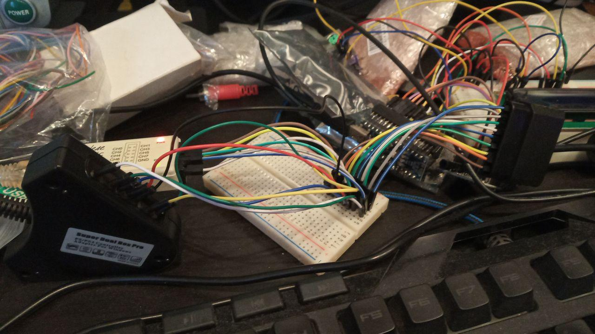
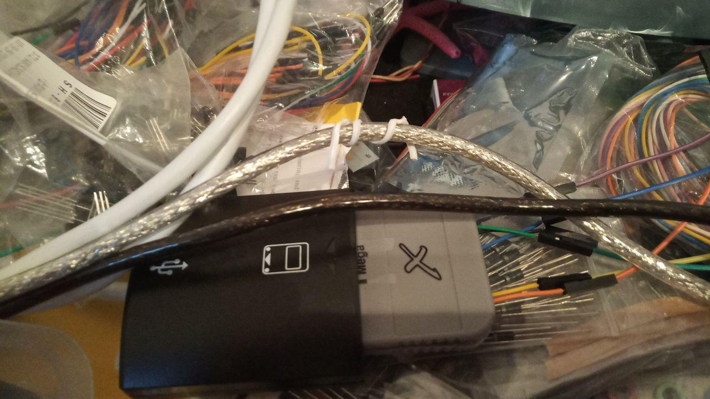
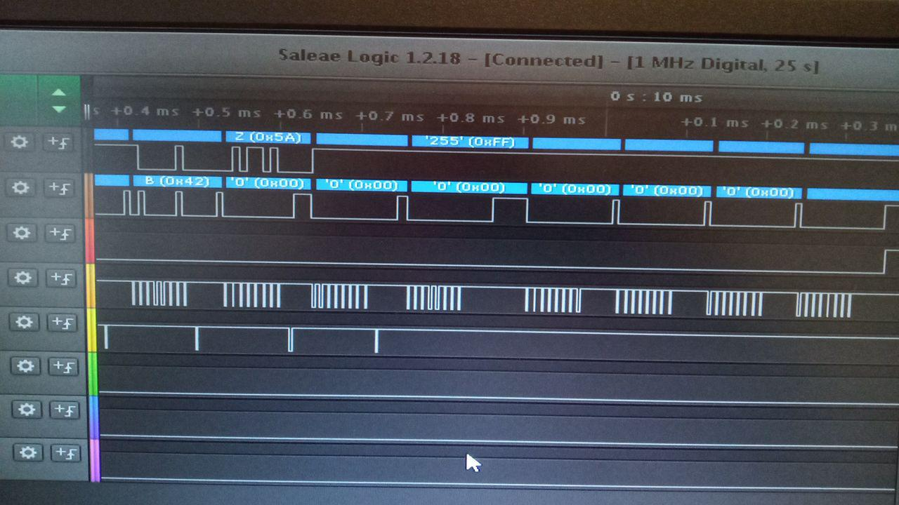

# Serial PAD
Permite usar un mando de psx <b>(conectado a la psx)</b> como si fuera un modem <b>(lento)</b> serie, pudiendo enviar ficheros o usar el teclado, en cualquier consola psx, incluida la psone.
Y lo más importante, se permite realizar un upload de un ps-exe directamente  a memoria o a la memory card.

<h2>Simulacion</h2>
Para pruebas rápidas estoy usando un emulador de psx (epsx) y un script (autohotkey) que envia las pulsaciones de teclas para el emulador.
Se usan 8 botones del mando, junto con 1 más (L1) para el pulso (sincronia) del dato.
En siguientes versiones se usara un arduino que con transistores activará o no los botones.

<table>
 <tr>
  <td>Button</td><td>Key</td><td>Bit</td>
 </tr>
 <tr>
  <td>L1</td><td>W</td><td>(sync)</td>
 </tr>
 <tr>  
  <td>L2</td><td>E</td><td>Q7</td>
 </tr>   
 <tr>  
  <td>R1</td><td>R</td><td>Q6</td>
 </tr>   
 <tr>     
  <td>R2</td><td>T</td><td>Q5</td>
 </tr>  
 <tr>  
  <td>Triangulo</td><td>D</td><td></td>
 </tr>  
 <tr>  
  <td>Cuadrado</td><td>S</td><td>Q3</td>
 <tr> 
 </tr>  
  <td>Circulo</td><td>X</td><td>Q2</td>
 <tr> 
 </tr>  
  <td>X</td><td>Z</td><td>Q1</td>
 <tr>      
  <td>Start</td><td>V</td><td>Q0</td>
 </tr>  
</table>

<h2>Fases de desarrollo</h2>
Se realiza un ataque en varios frentes, desde el m&aacute;s sencillo, al m&aacute;s complejo:
<ul>
 <li>Control de teclado remoto y real (puerto PC PS2) con arduino activando 9 botones del Gamepad, por medio
   de un protocolo muy simple de flanco ascendente, pero lento en velocidad. Se realizará un programa que envia los datos
   en msdos x86 100% compatible DOSBOX para el remoto via emulaci&oacute;n serie, así como la posibilidad de leer directamente de arduino el teclado con la libreria PS2keyboard.
  

 </li>
 <li>Envio de PS-exe a memoria de PSOne o a tarjeta de memoria de PSOne con arduino activando 9 botones del Gamepad,
  , por medio de un protocolo muy simple de flanco ascendente, pero lento en velocidad. Se realizará un programa que envia datos 
  en msdos x86 100% compatible DOSBOX para el remoto via emulaci&oacute;n serie
 </li>
 <li>Carga de PS-exe desde memorias de PSX (128 KB), con posibilidad de trozear el exe en varias tarjetas. Se realizará un programa en msdos x85 100% compatible DOSBOX para trocear el exe en múltiples .MCR de 128 KB. Dichos .MCR se puede guardar en tarjeta real desde PS2 o mediante el sakura de puerto paralelo (vmware con windows 95 y 98 con soporte puerto paralelo).
  

 </li>
 <li>
  Recepción de datos por medio de sonido de la PSX, los 2 canales de audio. Se realizará un programa en psx que genera tonos con pulsos que pueden ser decodificados como datos binarios. La psx recibirá comandos remotos y enviará los datos como sonido.
 </li>
 <li>
  Simulación de mando y memoria psx por medio de arduino. He capturado los comandos del mando de la psx, así como los de la memoria, al usar un protocolo SPI a 250 Khz. Estoy realizando un programa en arduino que al recibir los comandos, envie las respuestas a un programa en la psone que interprete para cargar datos.  
  

 </li>
</ul>

<h2>Conclusion</h2>
Se usa esta opción, porque mientras que la psx si dispone de puerto serie, la psone blanca, no. Se tiene por tanto que realizar modificaciones. Además se logra una alternativa al SIOCONS

<h2>Historial</h2>
Aún no es funcional de cara al usuario.
Permite recibir comando de recepcion de fichero, y se reciben 100 bytes.

