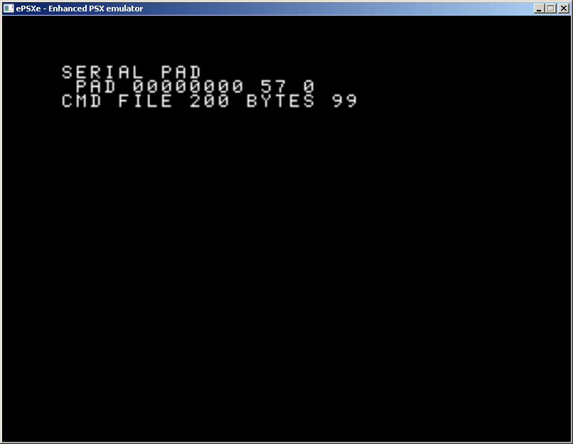

# Serial PAD
Permite usar un mando de psx <b>(conectado a la psx)</b> como si fuera un modem <b>(lento)</b> serie, pudiendo enviar ficheros o usar el teclado, en cualquier consola psx, incluida la psone.
Y lo más importante, se permite realizar un upload de un ps-exe directamente  a memoria o a la memory card.

<h2>Simulacion</h2>
Para pruebas rápidas estoy usando un emulador de psx (epsx) y un script (autohotkey) que envia las pulsaciones de teclas para el emulador.
Se usan 8 botones del mando, junto con 1 más (L1) para el pulso (sincronia) del dato.
En siguientes versiones se usara un arduino que con transistores activará o no los botones.

<table>
 <tr>
  <td>Button</td><td>Key</td><td>Bit</td>
 </tr>
 <tr>
  <td>L1</td><td>W</td><td>(sync)</td>
 </tr>
 <tr>  
  <td>L2</td><td>E</td><td>Q7</td>
 </tr>   
 <tr>  
  <td>R1</td><td>R</td><td>Q6</td>
 </tr>   
 <tr>     
  <td>R2</td><td>T</td><td>Q5</td>
 </tr>  
 <tr>  
  <td>Triangulo</td><td>D</td><td></td>
 </tr>  
 <tr>  
  <td>Cuadrado</td><td>S</td><td>Q3</td>
 <tr> 
 </tr>  
  <td>Circulo</td><td>X</td><td>Q2</td>
 <tr> 
 </tr>  
  <td>X</td><td>Z</td><td>Q1</td>
 <tr>      
  <td>Start</td><td>V</td><td>Q0</td>
 </tr>  
</table>

<h2>Conclusion</h2>
Se usa esta opción, porque mientras que la psx si dispone de puerto serie, la psone blanca, no. Se tiene por tanto que realizar modificaciones. Además se logra una alternativa al SIOCONS

<h2>Historial</h2>
Aún no es funcional de cara al usuario.
Permite recibir comando de recepcion de fichero, y se reciben 100 bytes.

