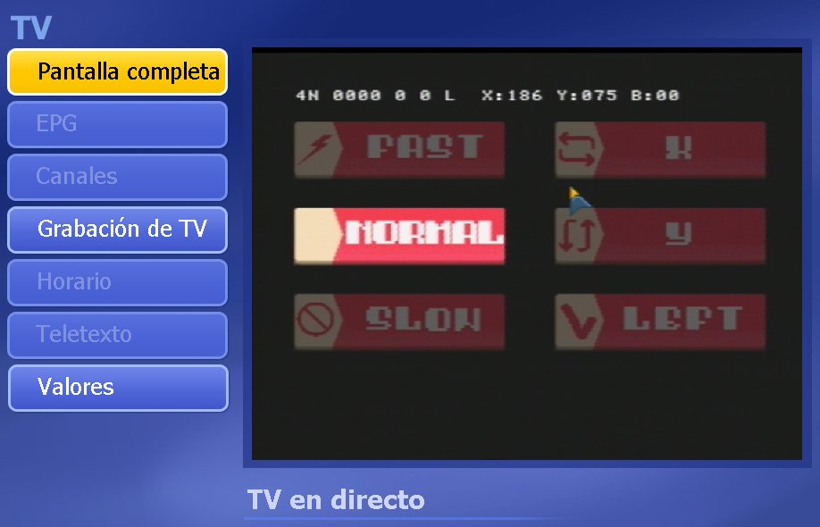
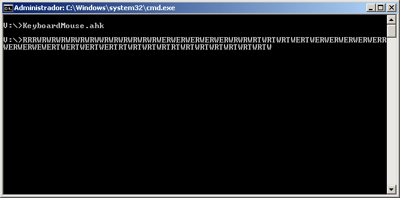
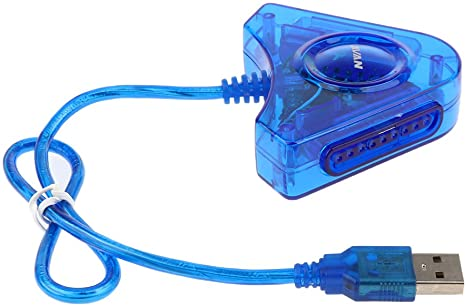
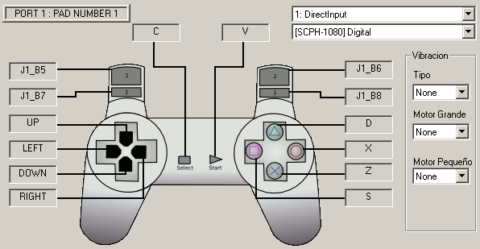
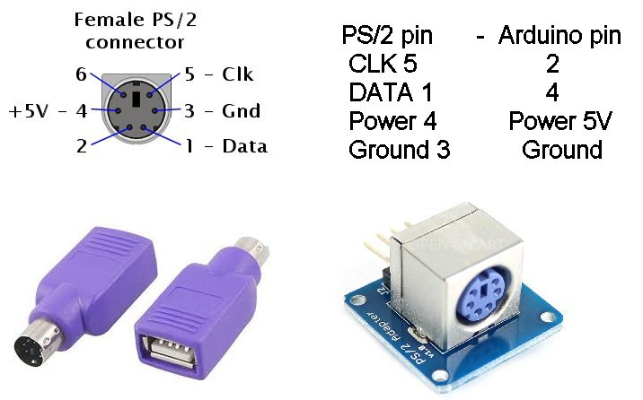
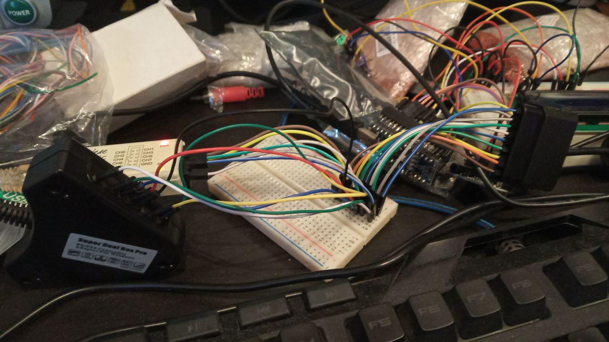
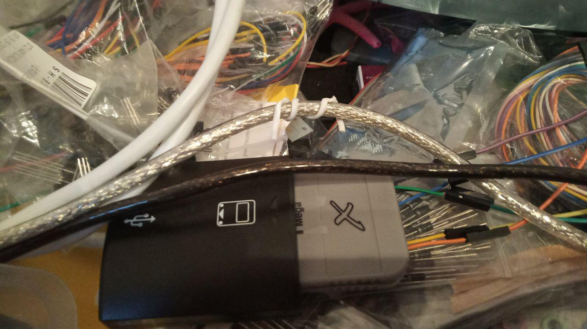

# Serial PAD
It allows you to use a PC keyboard or mouse on a real PSX connected to the control port. Supports:
<ul>
 <li><a href='#simulation'>Simulación</a></li>
 <li><a href='#padmodification'>Modificar mando</a></li>
 <li><a href="#padrealemulator">Mando físico en Emulador</a></li>
 <li><a href="#realpadrealconsole">Mando físico en consola real</a></li>
 <li><a href="#protocolo">Protocolo Ratón</a></li>
 <li><a href="#arduino">ARDUINO</a></li> 
 <li><a href="#uploadpsexe">Upload PsEXE</a></li>  
 <li><a href="#msdos">Uso de MSDOS</a></li>  
 <li><a href="#history">Historial</a></li>  
 <li><a href="#conclusion">Conclusion</a></li>  
</ul>
The features to be highlighted are:
<ul>
  <li><b>PS/2 Mouse (USB)</b> - 100% functional, includes test screen</li>
  <li><b>PS/2 keyboard (usb)</b> - function code, missing test display</li>
  <li><b>Slow serial communication</b> - function code, missing test display</li>
</ul>

This way you can enter data by keyboard or mouse on any model of PSX or PsOne by connecting a keyboard to a control port of the PSX, giving it greater autonomy, being able to act as a personal computer, for example. 

The mouse and keyboard that will be used are from PC, so this project, will not make use of PSX mice, that is, it is not compatible with the original PSX mouse, and it will only work with our program that translates button clicks. 
The results in real machine, are impressive, since it is very fast, both the mouse, as the keyboard. To upload it to a real machine, the most comfortable way is to use a cable <a href="http://hitmen.c02.at/html/psx_siocable.html">skywalker</a>, as I have it, and a usb to serial converter, as well as the modified version <b>send.exe</b> for Windows 64 bits.
  

<a name="simulation"><h2>Simulation</h2></a>
For those who don't want to modify a real PSX controller, tests can be done by emulation:
<ul>
 <li><a href="https://www.epsxe.com/">PSX emulator (ePSX)</a></li>
 <li><a href="https://www.autohotkey.com/">Auto Hot Key (Script keyboard and mouse)</a></li>
</ul>
Once the Auto Hot Key is installed, we will be able to launch the KeyboardMouse.ahk, which will translate the mouse movements and button presses into keyboard strokes, which the ePSX emulator will interpret as button presses of the controller. 

We must set the triggers of the control with the keys:
<ul>
 <li><b>R1</b> - R</li>
 <li><b>R2</b> - T</li>
 <li><b>L1</b> - W</li>
 <li><b>L2</b> - E</li> 
</ul>
If we launch the KeyboardMouse.ahk script in a command window, we'll see how moving the mouse generates keystrokes:

We must be careful, and make sure we are in the ePSX emulator window, because every time we do something with the mouse, it will be pressing keys. 

In the emulator, if we launch the main.exe, we will get the menu with the buttons:
<ul>
 <li><b>Fast</b> - Fast mouse speed</li>
 <li><b>Normal</b> - Normal speed</li>
 <li><b>Slow</b> - Slow speed</li>
 <li><b>X</b> - Reverses X-axis movement</li>
 <li><b>Y</b> - Reverse the Y-axis movement</li>
 <li><b>Left</b> - Left-handed</li>
</ul>
At the top, we will see information about the coordinates and mouse buttons, as well as the status of the PSX controller.
If we pass over the buttons, they will be illuminated, and if we click it will be activated. 
We must take into account that the emulation is not going well, since the keyboard script and the emulator have some delays, which in the end results in some non-flowing movements of the mouse and sporadic failures. However it is very useful to see that at least it works.
  

<a name="padmodification"><h2>Modify control</h2></a>
If we want a fluid response, we must modify the actual command.

The 4 buttons (side triggers) will be used, i.e. R1, R2, L1 and L2. The reason for this is that they are the easiest to modify without using a soldering iron, i.e. anyone can do it. These buttons are attached to the control plate with a wire for each of the buttons, and another for the ground. The way to detect a pressed button is very simple, just by joining it to the ground.
Not all controllers use the mass system, so we'll have to consider whether our controller is suitable for this project.

We must look with the multitester at the mass, which corresponds to the real mass of the control.
Then we will use a transistor buffer system that will activate the buttons. These transistors will be controlled by an ARDUINO, so that the data of the PS/2 mouse will be read and the buttons of the control will be activated.
We must cut the cables (the easiest way) or solder the board, an extension of cables to the outside, and then connect to the transistor buffer.

The resistance for the base of the transistor is 470 Ohms, and the transistor serves us 2n3904, which is the most basic and cheapest on the market. That doesn't stop us from doing the same with optocouplers or even solid relays.
  

<a name="padrealemulator"><h2>Physical control in Emulator</h2></a>
Once the ARDUINO has been updated with the mouse code, and connected to the PS/2, we can test the ePSX emulator, before trying a real PSX, thanks to a PSX to usb converter.

We have to configure the controller in the PSX emulator, so that we use the buttons on the controller, instead of the letters.

And if everything is correct, when running the main.exe, we can use the mouse.
  

<a name="realpadrealconsole"><h2>Physical control in real console</h2></a>
The following materials are required
<ul>
 <li>PSX control buttons R1,R2,L1,L2</li>
 <li>USB to PS/2 adapter or PS/2 mouse</li>
 <li>PS/2 keyboard</li>
 <li>PS/2 Mouse</li>
 <li>Arduino Nano or UNO</li>
</ul>
Once everything is connected and the main.exe is started, when you move the mouse, you will be able to see it on the screen. We must guarantee that our mouse is compatible with a PS/2 communication. Not all modern mice accept a conversion from USB to PS/2. To be sure, it is as simple as, debugging in ARDUINO following the output trace to the serial console, decomposing the code.

  

<a name="protocolo"><h2>Mouse Protocol</h2></a>
A very simple protocol similar to how mice were used in the early COMMODORE and MSX has been used per game port, but with several speed improvements. 
Every 25 milliseconds 4 bits are sent, containing:
<ul>
 <li>2 bits X movement</li>
 <li>2 bits Y movement</li>
</ul>
Or:
<ul>
 <li>2 bits left button</li>
 <li>2 bits right button</li> 
</ul>

Movement bits can be:
<ul>
 <li><b>00</b> - No movement</li>
 <li><b>01</b> - Positive movement</li>
 <li><b>11</b> - Negative movement</li>
</ul>
For the buttons, if the option <b>10</b> is given, the button is active.
Remember, that the PSX in each vertical delay, the data are read from the PAD, so they are read between 16 and 20 milliseconds. 
The 25 millisecond delay code is set on the Arduino, but we can change it to 50 milliseconds. In the case of the keyboard emulator, it is set to 50 milliseconds, since at lower times, synchronism problems occur.
  

<a name="arduino"><h2>ARDUINO</h2></a>
Almost any ARDUINO board can be used, but I have tested the NANO, which has 2 interruption pins, useful for the PS/2.
The pin layout is as follows:
<ul>
 <li>2 - CLK PS/2 connector</li>
 <li>4 - pin data PS/2 connector</li>
 <li>5 - transistor base L1</li>
 <li>6 - transistor base L2</li>
 <li>7 - transistor base R1</li>
 <li>8 - transistor base R2</li> 
</ul>
A very basic library has been used to read the mouse <b>PS2Mouse.h</b>, which is in charge of reading the mouse movement, as well as the state of the buttons. 
The pins will activate the base of the transistor, which will allow the buttons on the controller to be activated.
  

<a name="uploadpsexe"><h2>Upload PSexe</h2></a>
I am testing to use this command hack as a communications channel, modem style <b>(slow)</b> serial. I am using a SPI communications bus hack, with a hardcore fake slave spi, so there is no need to modify the remote.
And the most important thing, it is allowed to upload a ps-exe directly to memory or to the memory card.

Remember, the PSX can have up to 8 PSX controls by means of multitaps:
<ul>
 <li><b>8 x 14 buttons x 50 </b>= 5600 bits/s</li>
 <li><b>8 x 14 buttons x 60 </b>= 6720 bits/s</li>
 <li><b>8 x 16 buttons (analog mode) x 50</b>= 6400 bits/s</li>
 <li><b>8 x 16 buttons (analog mode) x 60</b>= 7680 bits/s</li>
 <li><b>8 x 48 bits (analog mode) x 50 </b>= 19200 bits/s</li>
 <li><b>8 x 48 bits (analog mode) x 60 </b>= 23040 bits/s</li>
</ul>

Putting it into practice physically is quite cumbersome, but it is easy to simulate.
  

<h2>Simulation</h2>
For quick tests I am using a psx emulator (epsx) and a script (autohotkey) that sends the keystrokes to the emulator.
There are 8 buttons on the controller, along with 1 more (L1) for the data pulse (synchronization).

<table>
 <tr>
  <td>Button</td><td>Key</td><td>Bit</td>
 </tr>
 <tr>
  <td>L1</td><td>W</td><td>(sync)</td>
 </tr>
 <tr>  
  <td>L2</td><td>E</td><td>Q7</td>
 </tr>   
 <tr>  
  <td>R1</td><td>R</td><td>Q6</td>
 </tr>   
 <tr>     
  <td>R2</td><td>T</td><td>Q5</td>
 </tr>  
 <tr>  
  <td>Triangle</td><td>D</td><td></td>
 </tr>  
 <tr>  
  <td>Square</td><td>S</td><td>Q3</td>
 <tr> 
 </tr>  
  <td>Circulo</td><td>X</td><td>Q2</td>
 <tr> 
 </tr>  
  <td>X</td><td>Z</td><td>Q1</td>
 <tr>      
  <td>Start</td><td>V</td><td>Q0</td>
 </tr>  
</table>

  

<h2>Other development fronts</h2>
An attack is made on several fronts, from the simplest to the most complex:
<ul>
  <li><b>Remote and real keyboard control</b> (PS2 PC port) with 9 Gamepad buttons activated by
   of a very simple protocol of rising edge and transistors, but slow in speed. A program that sends the data in msdos x86 100% compatible DOSBOX for the remote via serial emulator, as well as the possibility of reading directly from the keyboard with the PS2keyboard library.  
  

 </li>
  <li><b>Sending PS-exe</b> to PSOne memory or PSOne memory card with arduino by activating 9 buttons on the Gamepad
  by means of a very simple protocol of ascending flank, but slow in speed. A program that sends data in msdos x86 100% compatible DOSBOX for the remote via serial emulsion will be made
 </li>
 <li><b>Loading PS-exe</b> from PSX memory (128 KB), with the possibility of splitting the exe in several cards. A 100% DOSBOX compatible msdos x86 program will be made to slice the exe into multiple .MCR 128 KB. These .MCR can be saved in real card from PS2 by means of the <a href="https://gamesx.com/mccap/">sakura</a> of parallel port (vmware with windows 95 and 98 with parallel port support) or the <a href="https://github.com/ShendoXT/memcarduino">memcarduino</a>.
  

 </li>
 <li>
   <b>Receiving data by sound</b> from the PSX, the 2 audio channels. A program will be made in psx that generates tones with pulses that can be decoded as binary data. The psx will receive remote commands and send the data as sound.
 </li>
 <li>
   <b>Command and memory simulation</b> by means of arduino. I have captured the commands of the psx command, as well as those of the memory, using a 250 Khz SPI protocol. I am making a program in arduino that when it receives the commands, it sends the answers to a program in the psone that it interprets to load data.  
  

 </li>
</ul>
  

<a name="msdos"><h2>Use of MSDOS</h2></a>
The reason for using MSDOS, is to achieve maximum compatibility with DOSBOX, so that you can use the entire 16bits psyq development kit, as it can be used in almost any current machine that is not a PC. You can also use the msdosplayer for Windows 7 64 bits and above.
  

<a name="history"><h2>History</h2></a>
<ul>
 <li>2020/05/25 - 100% PS/2 mouse</li>
 <li><b>In tests</b> - PAD simulation with keyboard and ePSX emulator</li>
 <li>Commented code for keyboard use, and file sending (receives 100 bytes).</li>
</ul>
  

<a name="conclusion"><h2>Conclusion</h2></a>
This option is used because while the psx has a serial port, the white psone does not. You must therefore make modifications. In addition, an alternative to SIOCONS is achieved.
