# Serial PAD
Permite usar un teclado o ratón de PC en una PSX real conectada al puerto de mandos, así como enviar datos a la PSX. Soporta:
<ul>
 <li><a href='#simulation'>Simulación</a></li>
 <li><a href='#padmodification'>Modificar mando</a></li>
 <li><a href="#padrealemulator">Mando físico en Emulador</a></li>
 <li><a href="#realpadrealconsole">Mando físico en consola real</a></li>
 <li><a href="#protocolo">Protocolo Ratón</a></li>
 <li><a href="#arduino">ARDUINO</a></li> 
 <li><a href="#uploadpsexe">Upload PsEXE y datos</a></li>  
 <li><a href="#msdos">Uso de MSDOS</a></li>  
 <li><a href="#history">Historial</a></li>  
 <li><a href="#conclusion">Conclusion</a></li>  
</ul>
Las funcionalidades a destacar son:
<ul>
 <li><b>Ratón PS/2 (usb)</b> - 100% funcional, incluye pantalla de test</li>
 <li><b>Teclado PS/2 (usb)</b> - código funcional, falta pantalla de test</li> 
 <li><b>Comunicación lenta serie</b> - código funcional, falta pantalla de test</ul>
</ul>

De esta forma se puede introducir datos por teclado o ratón en cualquier modelo de PSX o PsOne conectando un teclado a un puerto de mandos de la PSX, dándole una mayor autonomía, pudiendo actuar de ordenador personal, por ejemplo. 

El ratón y teclado que van a usarse son de PC, así que este proyecto, no va a hacer uso de ratones de PSX, es decir, que no es compatible con el ratón de PSX original, y sólo funcionará con nuestro programa que traduce pulsaciones de botones. 
Los resultados en máquina real, son impresionantes, dado que es muy rápido, tanto el ratón, como el teclado. Para subirlo a máquina real, lo más comodo es usar un cable <a href="http://hitmen.c02.at/html/psx_siocable.html">skywalker</a>, tal y como yo lo tengo, y un conversor de usb a serie, así como la versión modificada <b>send.exe</b> para Windows 64 bits.
  

<a name="simulation"><h2>Simulación</h2></a>
Para todo aquel que no quiera modificar un mando real de PSX, se puede realizar pruebas mediante emulación:
<ul>
 <li><a href="https://www.epsxe.com/">Emulador de PSX (ePSX)</a></li>
 <li><a href="https://www.autohotkey.com/">Auto Hot Key (Script teclado y ratón)</a></li>
</ul>
Una vez instalado el Auto Hot Key, podremos lanzar el KeyboardMouse.ahk, que traducirá los movimiento y pulsación de botones del ratón en pulsaciones de teclado, que el emulador ePSX interpretará como pulsación de botones del mando. 

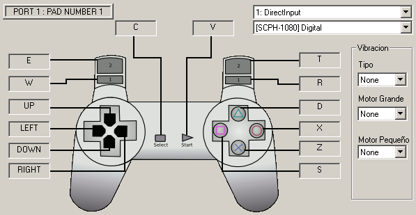

Debemos de configurar los gatillos del mando con las teclas:
<ul>
 <li><b>R1</b> - R</li>
 <li><b>R2</b> - T</li>
 <li><b>L1</b> - W</li>
 <li><b>L2</b> - E</li> 
</ul>
Si lanzamos el script KeyboardMouse.ahk en una ventana de comandos, veremos como al mover al ratón, se generan pulsaciones de teclas:

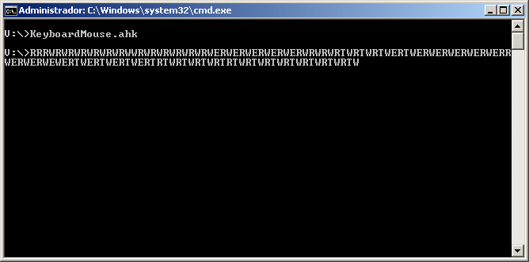

Debemos de tener cuidado, y asegurarnos de estar en la ventana del emulador ePSX, ya que cada vez que hagamos algo con el ratón, estará pulsando teclas. 

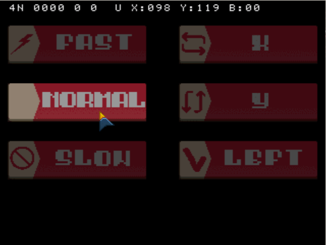

En el emulador, si lanzamos el main.exe, nos saldrá el menú con los botones:
<ul>
 <li><b>Fast</b> - Velocidad rápida del ratón</li>
 <li><b>Normal</b> - Velocidad normal</li>
 <li><b>Slow</b> - Velocidad lenta</li>
 <li><b>X</b> - Invierte el movimiento eje X</li>
 <li><b>Y</b> - Invierte el movimiento eje Y</li>
 <li><b>Left</b> - Zurdos</li>
</ul>
En la parte superior, nos aparecerá información de las coordenadas y botones del ratón, así como el estado del mando de la PSX.
Si pasamos por encima de los botones, se iluminarán, y si se hace click se activará. 
Debemos tener en cuenta, que la emulación no va bien, dado que el script de teclado y el emulador tiene unas demoras, que al final se traduce en unos movimientos no fluidos del ratón y fallos esporádicos. Sin embargo nos es muy útil para ver que al menos funciona.
  

<a name="padmodification"><h2>Modificar mando</h2></a>
Si queremos una respuesta fluida, debemos modificar el mando real.

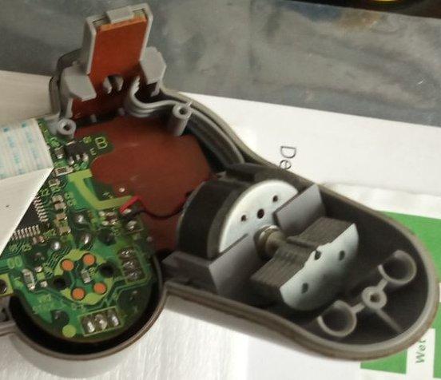

Se van a usar los 4 botones (gatillos laterales), es decir, R1, R2, L1 y L2. El motivo se debe a que son los más fáciles de modificar sin falta de usar soldador, es decir, que cualquiera puede hacerlo. Estos botones estan unidos a la placa del mando con un hilo para cada uno de los botones, y otro para la masa. La forma de detectar un botón pulsada, es muy sencilla, tna sólo con unirlo con la masa. 
No todos los mandos usan el sistema de masa, así que tendremos que tener en cuenta si nuestro mando sirve para este proyecto.

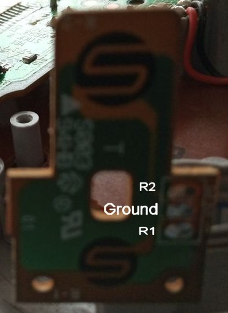

Debemos mirar con el multitester la masa, que se corresponde con la masa real del mando. 
Luego usaremos un sistema de buffer de transistores que activaran los botones. Dichos transistores seran controlados por un ARDUINO, de manera, que se leeran los datos del ratón PS/2 y se activarán los botones del mando.
Debemos cortar los cables (lo más facil) o bien soldar  la placa, una extensión de cables al exterior, para posteriormente conectar al buffer de transistores.

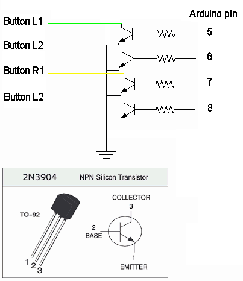

La resistencia para la base del transistor es de 470 Ohmios, y el transistor nos sirven el 2n3904, que es el más básico y barato del mercado. Eso no quita, que podamos hacer lo mismo con optoacopladores o incluso relés sólidos.
  

<a name="padrealemulator"><h2>Mando físico en Emulador</h2></a>
Una vez actualizado el ARDUINO con el código del ratón, y conectado el ratón al PS/2, podemos hacer pruebas sobre el emulador ePSX, antes de probar con una PSX real, gracias a un conversor de mandos PSX a usb.

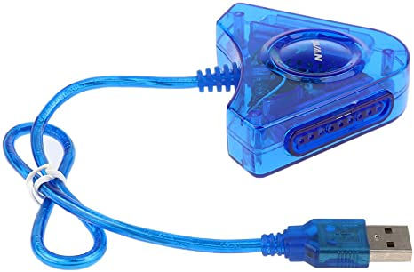

Debemos de configurar el mando en el emulador de PSX, de manera que usemos los botones del mando, en lugar de las letras.

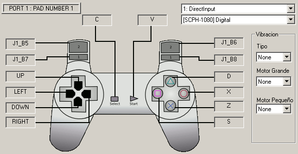

Y si todo es correcto, al ejecutar el main.exe, podremos usar el ratón.
  

<a name="realpadrealconsole"><h2>Mando físico en consola real</h2></a>
Se requiere los siguiente materiales
<ul>
 <li>Mando PSX botones R1,R2,L1,L2</li>
 <li>Adaptador usb a PS/2 o ratón PS/2</li>
 <li>Teclado PS/2</li>
 <li>Ratón PS/2</li>
 <li>Arduino Nano o UNO</li>
</ul>
Una vez todo conectado y arrancado el main.exe, al realizar movimientos del ratón, se podrá ver en la pantalla. Debemos garantizar que nuestro ratón sea compatible con una comunicación PS/2. No todos los ratones modernos aceptan una conversión de USB a PS/2. Para estar seguros, es tan sencillo como, depurar en ARDUINO siguiendo la traza de salida a la consola serie, descomentando el código.

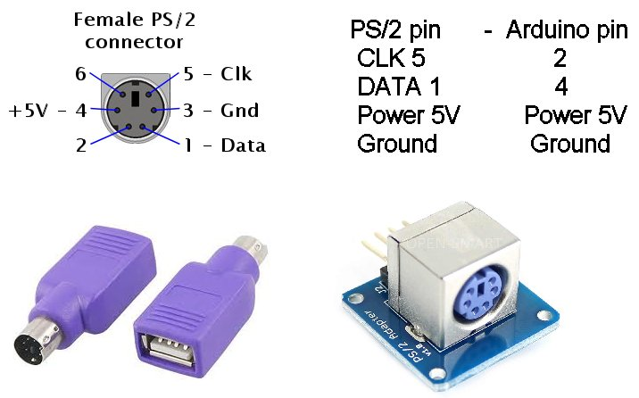

  

<a name="protocolo"><h2>Protocolo Ratón</h2></a>
Se ha usado un protocolo muy simple similar a como se usaban los ratones en los primeros COMMODORE y MSX por puerto de juegos, pero con varias mejoras de velocidad. 
Se envian cada 25 milisegundos 4 bits, que contienen:
<ul>
 <li>2 bits movimiento X</li>
 <li>2 bits movimiento Y</li>
</ul>
O bien:
<ul>
 <li>2 bits botón izquierdo</li>
 <li>2 bits botón derecho</li> 
</ul>

Los bits del movimiento pueden ser:
<ul>
 <li><b>00</b> - No hay movimiento</li>
 <li><b>01</b> - Movimiento positivo</li>
 <li><b>11</b> - Movimiento negativo</li>
</ul>
Para los botones, si se da la opción <b>10</b> es que el botón está activo.
Recordemos, que la PSX en cada retrazo vertical, se leen los datos del PAD, así que se leen entre 16 y 20 milisegundos. 
El código de demora de 25 milisegundos, está puesto en el Arduino, pero podemos cambiarlo a 50 milisegundos. Para el caso del emulador de teclado, está puesto a 50 milisegundos, dado que a tiempos inferiores, ocurren problemas de sincronismo.
  

<a name="arduino"><h2>ARDUINO</h2></a>
Se puede usar casi cualquier placa de ARDUINO, pero en concreto he realizado pruebas con el NANO, que dispone de 2 pines de interrupción, útiles para el PS/2. 
La disposición de pines es la siguiente:
<ul>
 <li>2 - CLK conector PS/2</li>
 <li>4 - pin datos conector PS/2</li>
 <li>5 - base transistor L1</li>
 <li>6 - base transistor L2</li>
 <li>7 - base transistor R1</li>
 <li>8 - base transistor R2</li> 
</ul>
Se ha usado una libreria muy básica de lectura del ratón <b>PS2Mouse.h</b>, que se encarga de leer el movimiento del ratón, así como el estado de los botones. 
Los pines activarán la base del transistor, que permitirá activar los botones del mando.
  
 

<a name="uploadpsexe"><h2>Upload PsEXE y datos</h2></a>
Permite enviar ejecutables y datos a la PSX por medio del puerto de mandos. Estoy usando un mando (4 botones) o un hack del bus de comunicaciones SPI, con un fake slave spi con arduino, de manera que no es necesario modificar el mando, tan sólo se requiere un alargador de mandos PSX, o directamente podemos conectar los cables al puerto.

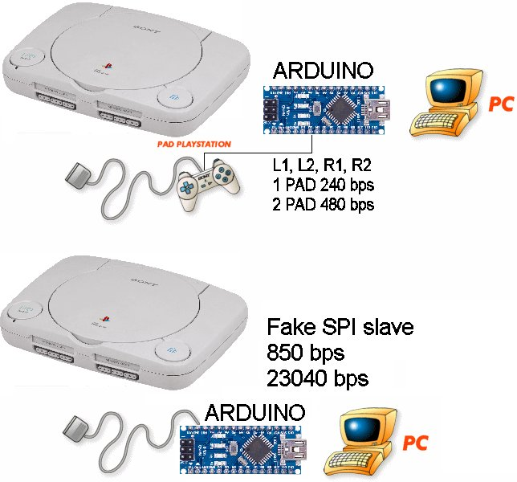

Actualmente estoy consiguiendo velocidades de 20480 baudios con un custom mensaje.
El cargador permite elegir el puerto en el que queremos el ARDUINO, así como el mando, y podemos seleccionar la velocidad con la que nos comunicaremos, por medio del mando con los botones de dirección.
Si aceptamos con el botón <b>X</b>, nos dará 10 segundos para desconectar el mando. Esto se hace así, para no interferir en el bus SPI. Si dejasemos el mando, daria problemas de comunicaciones.
Si aceptamos con el botón <b>O</b>, en cuanto desconectemos el mando, nos dará 10 segundos para arrancar, garantizando que hemos desconectado fijo.
Si pulsamos <b>START</b>, reinicia a la posición del cargador de PSXSerial de Hitmen, y si pulsamos <b>SELECT</b> se restablece el programa.
Si en 10 segundos no recibimos datos correctos o si ocurre un error, se reinicia el programa (no se borra memoria).

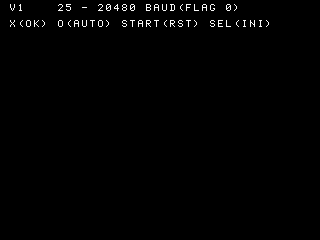

Para recibir datos, primero tenemos que tenerlos generados. Para ello, usaremos la herramienta GENFRAME, realizada en PASCAL y que funciona en DOSBOX.

Los modos de velocidad para mando 4 botones (transistores), con cargador UploadExe:
<ul>
 <li><b>0</b> - (50 ms 3 bits 60 baudios)</li>
 <li><b>1</b> - (25 ms 3 bits 120 baudios)</li>
</ul>

Los modos de velocidad para emulación mando digital emulado (fake spi), con cargador UploadExe:
<ul>
 <li><b>0</b> - (50 ms 3 bits 60 baudios)</li>
 <li><b>1</b> - (25 ms 3 bits 120 baudios)</li>
 <li><b>2</b> - (50 ms 8 bits 160 baudios)</li>
 <li><b>3</b> - (25 ms 8 bits 320 baudios)</li>
</ul> 
 
Los modos de velocidad para emulación mando analógico emulado (fake spi), con cargador UploadExe:
<ul>  
 <li><b>8</b> - (50 ms 16 bits 320 baudios)</li>
 <li><b>9</b> - (25 ms 16 bits 640 baudios)</li>
 <li><b>10</b> - (50 ms 32 bits 640 baudios)</li>
 <li><b>11</b> - (25 ms 32 bits 1280 baudios)</li>
</ul>

Los modos de velocidad para mensajes custom, con cargador PADSIO: 
<ul>
 <li><b>12</b> - (50 ms 64 bits 1280 baudios)</li>
 <li><b>13</b> - (25 ms 64 bits 2560 baudios)</li>
 <li><b>14</b> - (50 ms 112 bits 2240 baudios)</li>
 <li><b>15</b> - (25 ms 112 bits 4480 baudios)</li>
 <li><b>16</b> - (50 ms 128 bits 2560 baudios)</li>
 <li><b>17</b> - (25 ms 128 bits 5120 baudios)</li>
 <li><b>18</b> - (50 ms 224 bits 4480 baudios)</li>
 <li><b>19</b> - (25 ms 224 bits 8960 baudios)</li>
 <li><b>20</b> - (50 ms 256 bits 5120 baudios)</li>
 <li><b>21</b> - (25 ms 256 bits 10240 baudios)</li>
 <li><b>22</b> - (50 ms 448 bits 8960 baudios)</li>
 <li><b>23</b> - (25 ms 448 bits 17920 baudios)</li>
 <li><b>24</b> - (50 ms 512 bits 10240 baudios)</li>
 <li><b>25</b> - (25 ms 512 bits 20480 baudios)</li>
</ul>
Esta herramienta se puede lanzar:
<pre>
 GENFRAME demo1.exe frame.txt 80010000 12 0 25
</pre>
Este ejemplo, sería para el ejecutable <b>demo1.exe</b> convirtiéndolo en datos ASCII hexadecimales en el archivo <b>frame.txt</b>, dejando la cabecera de memoria en <b>80010000</b>, con el modo de velocidad 12 (1280 baudios), sin compresión y con 25 milisegundos.

Tenemos 2 cargadores, que usaremos según nos interese:
<ul>
 <li><b>UploadExe</b> - usa las librerias asíncronas PADLIB para comunicarse (velocidades de 0 a 11)</li>
 <li><b>PADSIO</b> - usa comunicación directa al puerto PADSIO (velocidades de 12 a 25)</li>
</ul>

Los 25 milisegundos, son la espera en cada transmisión de datos. Si queremos la máxima velocidad, lo mejor es compilar en modo NTSC nuestro cargador (teoría del muestreo), dado que soporta 60 fps.
<ul>
 <li><b>NTSC</b> - 60 fps</li>
 <li><b>PAL</b> - 50 fps</li>
</ul>

Se permite enviar datos al estilo de la herramienta <b>pqbload</b>:
<ul>
 <li><b>TIM</b> - texturas</li>
 <li><b>CEL</b> - </li>
 <li><b>BGD</b> - </li>
 <li><b>TMD</b> - </li>
 <li><b>EXE</b> - Ejecutable (automáticamente lo lanza)</li>
 <li><b>HMD</b> - </li>
 <li><b>SEQ</b> - sonido</li>
 <li><b>SEP</b> - sonido</li>
 <li><b>VAG</b> - sonido</li>
 <li><b>VAB</b> - sonido</li> 
</ul>
Cuando los archivos no son ejecutables, se dejan en la posición de memoria especificada, y se reinicia el cargador, permitiendo cargar más datos, hasta que sea un ejecutable, que es cuando se lanza. De esta forma, podemos pasar todo tipo de datos para proyectos más complejos, dejando los datos en posiciones fijas, y sólo cargando el EXE.
Cuando se carga un fichero de datos, se muestra el tipo en el mensaje de la espera de desconexión del mando.

  

<h2>Otros frentes de desarrollo</h2>
Se realiza un ataque en varios frentes, desde el m&aacute;s sencillo, al m&aacute;s complejo:
<ul>
 <li><b>Control de teclado remoto y real</b> (puerto PC PS2) con arduino activando 9 botones del Gamepad, por medio
   de un protocolo muy simple de flanco ascendente y transistores, pero lento en velocidad. Se realizará un programa que envia los datos en msdos x86 100% compatible DOSBOX para el remoto via emulaci&oacute;n serie, así como la posibilidad de leer directamente de arduino el teclado con la libreria PS2keyboard.
  
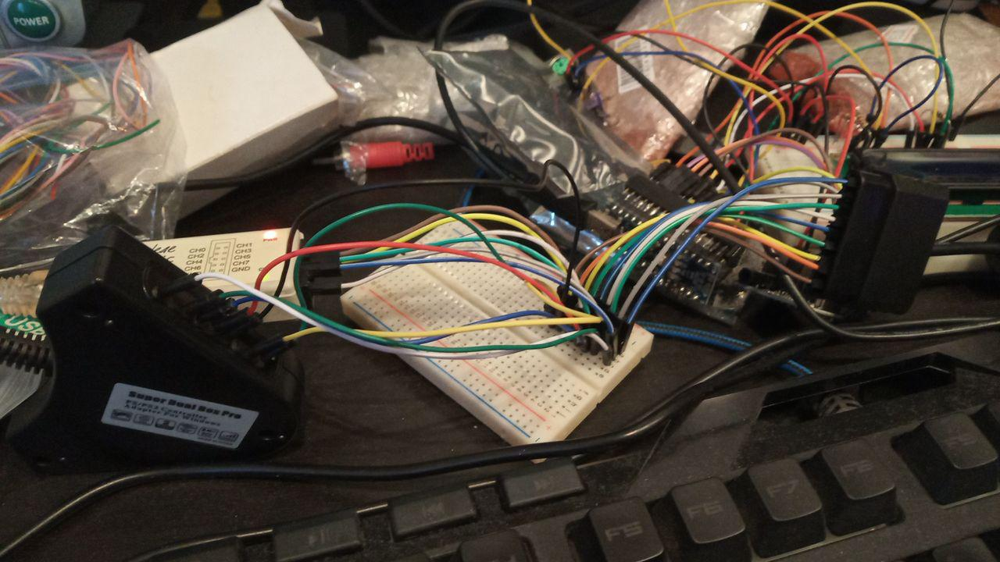

 </li>
 <li><b>Envio de PS-exe</b> a memoria de PSOne o a tarjeta de memoria de PSOne con arduino activando 9 botones del Gamepad,
  , por medio de un protocolo muy simple de flanco ascendente, pero lento en velocidad. Se realizará un programa que envia datos en msdos x86 100% compatible DOSBOX para el remoto via emulaci&oacute;n serie
 </li>
 <li><b>Carga de PS-exe</b> desde memorias de PSX (128 KB), con posibilidad de trozear el exe en varias tarjetas. Se realizará un programa en msdos x86 100% compatible DOSBOX para trocear el exe en múltiples .MCR de 128 KB. Dichos .MCR se puede guardar en tarjeta real desde PS2 mediante el <a href="https://gamesx.com/mccap/">sakura</a> de puerto paralelo (vmware con windows 95 y 98 con soporte puerto paralelo) o el <a href="https://github.com/ShendoXT/memcarduino">memcarduino</a>.
  
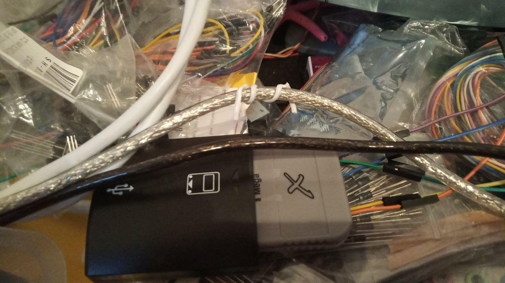

 </li>
 <li>
  <b>Recepción de datos por medio de sonido</b> de la PSX, los 2 canales de audio. Se realizará un programa en psx que genera tonos con pulsos que pueden ser decodificados como datos binarios. La psx recibirá comandos remotos y enviará los datos como sonido.
 </li>
 <li>
  <b>Simulación de mando y memoria</b> psx por medio de arduino. He capturado los comandos del mando de la psx, así como los de la memoria, al usar un protocolo SPI a 250 Khz. Estoy realizando un programa en arduino que al recibir los comandos, envie las respuestas a un programa en la psone que interprete para cargar datos.  
  
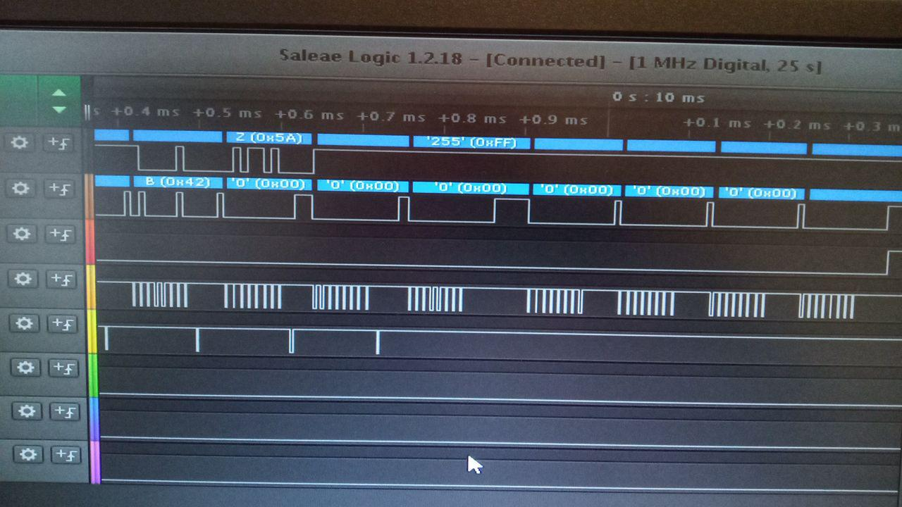

 </li>
</ul>
  

<a name="msdos"><h2>Uso de MSDOS</h2></a>
El motivo de usar MSDOS, es para lograr máxima compatibilidad con DOSBOX, de forma que se puede usar todo el kit de desarrollo psyq de 16bits, ya que así se puede usar en casi cualquier máquina actual que no sea PC. También se puede usar el msdosplayer para Windows 7 64 bits en adelante.
  

<a name="history"><h2>Historial</h2></a>
<ul>
 <li>2020/05/25 - 100% ratón PS/2</li>
 <li><b>En pruebas</b> - Simulación de PAD con teclado y emulador ePSX.</li> 
 <li>Código comentado para uso de teclado, y envio de ficheros (recibe 100 bytes).</li>
</ul>
  

<a name="conclusion"><h2>Conclusion</h2></a>
Se usa esta opción, porque mientras que la psx si dispone de puerto serie, la psone blanca, no. Se tiene por tanto que realizar modificaciones. Además se logra una alternativa al SIOCONS.
